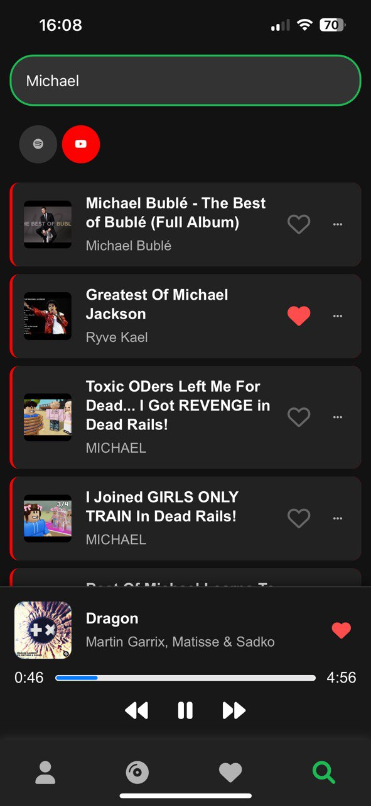

# 🎶 Music Streaming Platform - Full Stack Project

Modern music streaming platform featuring Spotify & YouTube integration, AI playlist generation, and seamless background playback.

<div align="center">
  
  
  
</div>

---

## ✨ Key Features
- **Multi-source Search:** Unified search across Spotify and YouTube APIs  
  
  
- **Smart Playlists:** AI-generated playlists from custom text prompts  
  
  
- **Offline Mode:** Service Worker caches recent tracks  
- **Cross-Device Sync:** Favorites persist across devices  
  
  
- **Detailed History:** Track listening habits with timestamps  
  

---

## 🛠 Tech Stack

### Backend
- **Python & Flask** - Lightweight API server  
- **PostgreSQL** - Stores user data like these favorites:  
  
  
- **Docker** - Containerized services  
- **Spotify/YouTube APIs** - Powering these integrations:  
  

### Frontend
- **Vanilla JS** - No framework bloat  
- **PWA Architecture** - Installable experience:  
  
  
- **MediaSession API** - Native OS controls

---

## 🚀 User Flow

1. **Secure Login**  
   

2. **Discover Music**  
   ```plaintext
   Featured in screens:
   - Martin Garrix
   - Michael Jackson
   - Black Eyed Peas